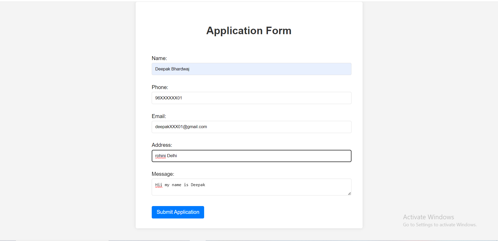
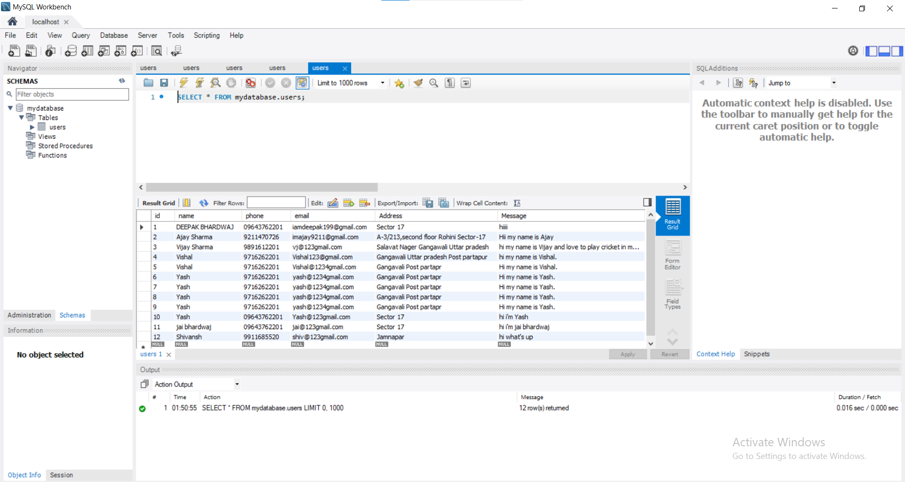
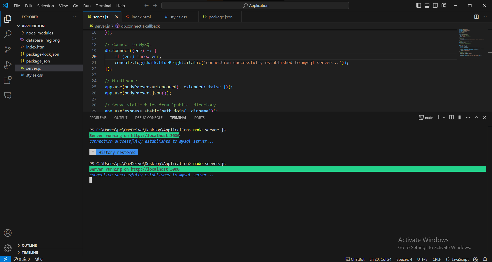

# Registration-Form
It is an Registration Form Using Html,Css,Node.js,express along with Mysql server : it is an full fledged Application /Registration Form  in which user can add there deails using form &amp;also they can also see there results in database mysql workbench :

Created with Vs code & Mysql Workbench :
   

   

    
    

    
